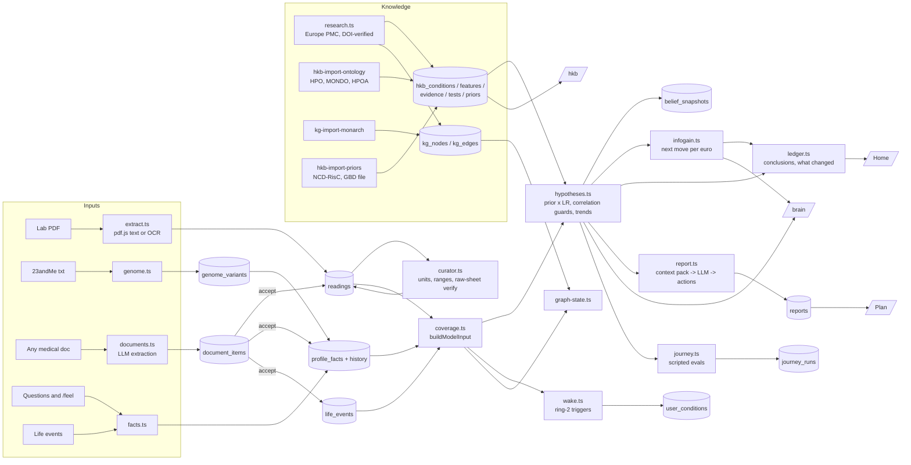

# OpenVitals `simple`: how it is built and how data flows

Diagrams render on GitHub (Mermaid). Numbers are the local production
copy on 2026-08-31. Legacy tables from the old app stay in the same
database, untouched, and are read once by `import-legacy`.

## 1. The one-paragraph model

A person's **inputs** (lab PDFs, genome file, documents, interview facts,
life events, later wearables) become **findings** (`readings`,
`profile_facts`, `genome_variants`, `document_items`, `life_events`).
A shared **knowledge base** (conditions, features, evidence with
likelihood ratios, tests with prices, priors by country/sex/age, a
mechanism graph) is scored against the person's findings by a
deterministic **engine** (`scoreHypotheses`, `nextMoves`, `wake`) into
**beliefs** per condition. The LLM only extracts numbers from text
(PDF, papers, documents) and writes sentences for the plan. Pages are
windows onto beliefs and knowledge; admin windows show the machinery.

## 2. Data flow

## 3. Tables, grouped

```mermaid
erDiagram
  users ||--o{ uploads : owns
  users ||--o{ readings : owns
  users ||--o{ profile_facts : owns
  users ||--o{ profile_fact_history : owns
  users ||--o{ genome_variants : owns
  users ||--o{ life_events : owns
  users ||--o{ reports : owns
  users ||--o{ belief_snapshots : owns
  users ||--o{ user_conditions : "ring-2 awake"
  users ||--o{ optimal_overrides : owns
  users ||--o{ protocol_items : owns
  users ||--o{ review_items : owns
  uploads ||--o{ readings : produced
  uploads ||--o{ document_items : proposed
  metrics ||--o{ readings : "code"
  hkb_conditions ||--o{ hkb_evidence : has
  hkb_features ||--o{ hkb_evidence : reads
  hkb_conditions ||--o{ hkb_priors : has
  hkb_conditions ||--o{ hkb_prior_modifiers : has
  hkb_conditions ||--o{ hkb_condition_tests : has
  hkb_tests ||--o{ hkb_condition_tests : has
  hkb_conditions ||--o{ hkb_interventions : has
  hkb_terms ||--o{ hkb_annotations : "HPOA"
  kg_nodes ||--o{ kg_edges : from_to
  hkb_revisions ||--o{ belief_snapshots : "kb_revision"
```

| Group               | Tables (rows today)                                                                                                                                                                                                                                   | What lives there                                                                                                                                                |
| ------------------- | ----------------------------------------------------------------------------------------------------------------------------------------------------------------------------------------------------------------------------------------------------- | --------------------------------------------------------------------------------------------------------------------------------------------------------------- |
| Person: findings    | `uploads` 43, `readings` 1,265, `profile_facts` 23, `profile_fact_history` 5, `genome_variants` 16, `document_items` 17, `life_events` 0, `daily_logs`, `optimal_overrides` 35                                                                        | Everything measured or answered. Readings are never deleted; corrections are flags with the original. Facts have a dated history with `changed` vs `corrected`. |
| Person: derived     | `belief_snapshots` 28, `user_conditions` 0 (awake ring-2 rows), `reports` 7, `review_items` 296, `protocol_items`, `goals`, `calibration_events` 4, `journey_runs` 27                                                                                 | What the engine and the LLM produced, versioned so "what changed" can be explained.                                                                             |
| Knowledge: catalog  | `hkb_conditions` 10,629 (32 ring 1, 10,597 ring 2), `hkb_features` 166, `hkb_evidence` 247, `hkb_tests` 82, `hkb_condition_tests` 78, `hkb_priors` 15,442, `hkb_prior_modifiers` 69, `hkb_interventions` 57, `hkb_revisions` 46, `hkb_import_runs` 99 | Every number the engine multiplies, with source, grade, paper and status.                                                                                       |
| Knowledge: ontology | `hkb_terms` 51,943 (HPO 19,839 + MONDO 32,104), `hkb_annotations` 285,455                                                                                                                                                                             | Names, synonyms, phenotype frequencies. Search (pg_trgm) and ring-2 waking read these.                                                                          |
| Knowledge: graph    | `kg_nodes` 232, `kg_edges` 219                                                                                                                                                                                                                        | Mechanisms: what raises or lowers what, with `when_` clauses for personal conditions (genome, timing).                                                          |
| Legacy (read-only)  | `observations` 1,267, `metric_definitions` 265, `source_artifacts` 37, …                                                                                                                                                                              | The old app's tables. `import-legacy` reads them once.                                                                                                          |
| Auth                | `users` 3, `accounts`, `sessions`, `verifications`                                                                                                                                                                                                    | better-auth.                                                                                                                                                    |

## 4. Modules (`apps/simple/lib`, 35k lines incl. tests)

| Layer        | Files                                                                                                                                                                                                            | Purpose                                                                           |
| ------------ | ---------------------------------------------------------------------------------------------------------------------------------------------------------------------------------------------------------------- | --------------------------------------------------------------------------------- |
| Ingest       | `extract.ts`, `pdf.ts`, `uploads.ts`, `genome.ts`, `genome-catalog.ts`, `documents.ts`, `import-legacy.ts`                                                                                                       | Turn files into readings, variants, proposed items.                               |
| Hygiene      | `curator.ts`, `units.ts`, `merge-metrics.ts`, `raw-verify.ts`                                                                                                                                                    | Units, ranges, duplicates, lab-sheet verification; questions only for real calls. |
| Person model | `coverage.ts` (ModelInput), `facts.ts` (history), `derived.ts` (eGFR, HOMA, FIB-4, PhenoAge, slopes), `vectors.ts` (tier-0 facts, rules), `symptoms.ts`, `data.ts`                                               | One typed snapshot of a person for the engine.                                    |
| Knowledge    | `hkb.ts`, `hkb-catalog.ts`, `hkb-seed.ts`, `hkb-priors.ts`, `hkb-policy.ts`, `hkb-pool.ts`, `hkb-import.ts`, `hpoa.ts`, `research.ts`, `rings.ts`, `lookup.ts`, `prices.ts`, `countries.ts`, `kg.ts`, `graph.ts` | Load, grow, grade, pool, search.                                                  |
| Engine       | `hypotheses.ts`, `infogain.ts`, `tree.ts`, `wake.ts`, `graph-state.ts`, `pathograph.ts`, `patterns.ts`, `calibration.ts`                                                                                         | Score, choose the next move, wake dormant diseases, personal graph. Pure; tested. |
| Output       | `ledger.ts` (Home), `report.ts` (Plan, the only LLM prose), `brain.ts`, `sample.ts`, `journey.ts`, `ask.ts`                                                                                                      | Pages and evals read these.                                                       |

## 5. Where the LLM is allowed

1. `extract.ts`: lab PDF text → readings (and OCR for scans).
2. `documents.ts`: any document → proposed findings with quotes.
3. `research.ts`: paper abstracts → LRs, interventions, mechanism edges, each with a verbatim quote and a resolved DOI.
4. `report.ts`: context pack → plan sentences and actions (thresholds and ordering come from the engine).
5. `curator.ts`: metric identity (is "Hematii" the same as RBC) and optimal-band proposals with sex/age.

Everywhere else is arithmetic.

## 6. Admin windows

`/brain` (scores, moves, tree, journeys), `/hkb` (conditions, evidence, priors, tests, interventions, activity, calibration), `/admin` (curator runs). Never removed; users never see them.
